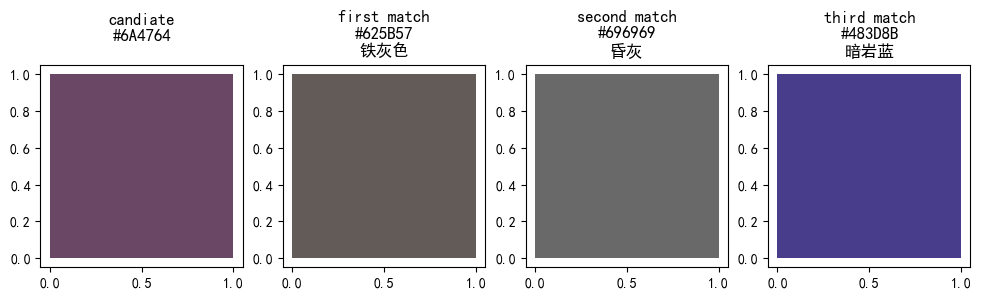
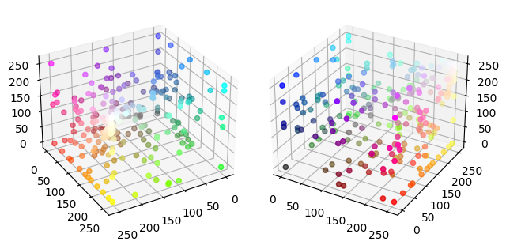

This topic first came to my mind when I was in college as a freshman. I don't quite remember what application I am going to embed this. But the goal is clear: for color in HEX or RGB format, find a name to describe it accurately.

Recently, I saw a forum thread. A color-blind person is looking for a solution to identifying the color. I immediately recall the experience I had almost five years ago.

But after I did some prototype coding, I found the result was not as good as I expected, which drove me to learn more about the topic.

And the result is this article.

## Understand Color (1)

> We won't discuss the basal stuff. Just the numeric representation of the RGB color model. You can learn more about color @ [Wikipedia](https://en.wikipedia.org/wiki/Color)

First, we need to know how to represent a color in the computer. The RGB color model describes the color as a mixture of three primary colors: **R**ed, **G**reen, and **B**lue. Each color has an integer intensity value between 0 and 255 (0 means no such color, 255 means such color has maximum intensity). So, having these three numbers, we can indicate a color.




In HTML, pure white color under such a model is `RGB(255,255,255)`. comma-separated values match the Red, Green, and Blue colors in order. By converting each color value from decimal to hexadecimal, we have a tidier form, `RGB(#FFFFFF)`. I provide an interactive slider below, so you play with the intensity of each primary color and see the mixing result.



## Color Naming

Consider three primary colors, each with 256 different intensities. We have $256^3 = 16777216$ possible colors. But our commonsense tells us that we don't have such an enormous number of names for colors. But we can take several dominant color naming schemes that provide various names.

Two easy-to-access examples are the [X11 color names](https://en.wikipedia.org/wiki/X11_color_names) and [CSS Color Module Level 3](https://www.w3.org/TR/css-color-3/) ([Basic](https://www.w3.org/TR/css-color-3/#html4), [Extended](https://www.w3.org/TR/css-color-3/#svg-color)). Especially the CSS Color Module Level 3, which you can directly use when writing web pages.

The [PANTONE Color](https://www.pantone.com/) is a more proprietary and well-known color naming system. They put effort on standardize the color, and their color matching system are used all around the world. The general public gets to sound them by the annual “Color of the year” published since 2000. In 2022, the color of the year is **PANTONE 17-3938** Very Peri.




In our case, we need the color name and its corresponding RGB value, so I made a Chinese color [name mapping file](https://gist.github.com/ecwu/461a1567ec5ab55dbaf18701c3e4c08b) using [the list from Wikipedia](https://zh.wikipedia.org/wiki/%E9%A2%9C%E8%89%B2%E5%88%97%E8%A1%A8), I also made an English one which I stored [here](https://gist.github.com/ecwu/d7534ef90c936e034c68b68281d9ad88). 

> In the mapping files I create, there are 248 colors named in Chinese and 977 colors named in English. Personally, I thought some color names used in English were less intuitive. And as a native Chinese speaker, I am more familiar with those Chinese color names, So in the following examples on color naming, I will use the Chinese name mapping file (I will provide translation or description).

## Distance Between Colors
Consider the RGB color space. If we set each color intensity as the axis of the rectangular coordinates, we can form a $255^3$ size cube. Points inside the cube represent different colors (consider only the integer value).

{{< figure
  src="https://upload.wikimedia.org/wikipedia/commons/thumb/a/af/RGB_color_solid_cube.png/1024px-RGB_color_solid_cube.png"
  class="class param"
  
  title="The RGB color model mapped to a cube. The horizontal x-axis as red values increasing to the left, y-axis as blue increasing to the lower right and the vertical z-axis as green increasing towards the top. The origin, black is the vertex hidden from view."
  caption="Wikimedia Commons, by"
  label="colorcube"
  attr="SharkD"
  attrlink="https://commons.wikimedia.org/wiki/File:RGB_color_solid_cube.png"
  alt="alt"
 >}}


When we find a name for a color, if there is no exact match in the naming mapping, we can find a similar match by calculating the “distance” and finding the color and its name with the slightest distance difference.

The distance here is the $L_2$ distance ([Euclidean distance](https://en.wikipedia.org/wiki/Euclidean_distance)). For $C_1: \[R_1, G_1, B_1\]$ and $C_2: \[R_2, G_2, B_2\]$:

$$d(\[R_1, G_1, B_1\], \[R_2, G_2, B_2\]) = \sqrt{(R_1-R_2)^2+(G_1-G_2)^2+(B_1-B_2)^2}$$

The algorithm will traverse and calculate the distance between the query color $C_1$ all colors $C_k$ in the list and uses the color with minimum distance $min(d(\[R_1, G_1, B_1\], \[R_k, G_k, B_k\]))$ as the closest match.

I create these codes to do the procedure above.

```python
import pandas as pd
import math

def hex_to_rgb(hex):
    h = hex.lstrip('#')
    return tuple(int(h[i:i+2], 16) for i in (0, 2, 4))

def calculate_distance(cor1, cor2):
    c1 = hex_to_rgb(cor1)
    c2 = hex_to_rgb(cor2)
    return math.sqrt((c1[0]-c2[0])**2+(c1[1]-c2[1])**2+(c1[2]-c2[2])**2)

def closest_n_color(c_list, candidate, n=10):
    distance_dict = dict()
    for name, _hex in c_list:
        distance_dict[name] = calculate_distance(candidate, _hex)
    return [[k, v] for k, v in sorted(distance_dict.items(), key=lambda c: c[1])][:n]

if __name__ == "__main__":
    match_list = pd.read_csv('color-name-mapping-cn.csv').values.tolist()
    source = '#FFFFFF'
    print(closest_n_color(match_list, source))
```

Use `#FFFFFF` (white) color for a try, the program return the top three matches: `[['白色 (White)', 0.0], ['雪色 (Snow White)', 7.0710678118654755], ['幽灵白 (Ghost White)', 9.899494936611665]]`. We can see that except for the exact match, the other two matches pretty much refer to the same color: White. So, it seem that our little program has been working perfectly!

### Problem

But when I tried another color, like `#6A4764`. Seeing it with my eye, the color belongs to dark magenta and dark purple. But the program's result is not as close. It returns *iron-gray*, *dust gray*, and *dark rock blue*. When we look closer at the color distance. The dark magenta (`#8B008B`) has a $d = 87.46$ but the others is way less ($\[25.15, 34.38, 52.69\]$).


> Please hover the picture to see the original color in dark mode.

Why this happens?

## Understand Color (2)

I try to visualize the named colors in 3d space. Those colors aren't uniformly distributed. Some are clustered together, and some are relatively sparse with almost no named color. This means some of the colors may not be easy to describe.


> Please hover the picture to see the original color in dark mode.

The other problem is that such a color model is hard to understand. When manipulating a color, how to make it to some color or “more that color" (hue, saturation; not just red, green, or blue); How to make it brighter or darker.

The HSV color model is preferred instead of the RGB color model, in which the HSV color space is converted from the RGB color space.



> Visualisation for conversion between color models RGB and HSV. video from [Wikimedia Commons](https://commons.wikimedia.org/w/index.php?title=File%3ARGB_2_HSV_conversion_with_grid.ogg), by VerbaGleb.

As shown in the video, the original color cube of the RGB color model is converted into a cylinder object. At the cylinder’s cap, we can easily see distinguishable colors. And color at the top is the brightest, and it gets darker at the bottom. Slice out a layer of cylinder horizontally, the color inside is more faded, and the exterior color is more vivid.

My verbal description of the HSV color cylinder is actually its three variables: **H**ue, **S**aturation and **V**alue (Or Brightness). Here are their definitions:

- Hue: The “attribute of a visual sensation according to which an area appears to be similar to one of the perceived colors: red, yellow, green, and blue, or to a combination of two of them”.
- Saturation: The “colorfulness of a stimulus relative to its own brightness.”
- Value: The “attribute of a visual sensation according to which an area appears to emit more or less light.”

The hue in the HSV color model could help distinguish color, which you can try with the following interactive tool.



### RGB to HSV Converstion

First, scale the range for $R, G, B$ to 0 and 1 by dividing 255 to each color channel and getting $R', G', and B'$.

$$M=\max(R',G',B')$$

$$m=\min(R',G',B')$$

$$C= M - m$$

> $C$ is also call [Chroma](https://en.wikipedia.org/wiki/Colorfulness#Chroma).

Then, we can calculate H, S, L with the equations.

#### Hue

$$H=\begin{cases}
   0\degree, & \text{if } C = 0 \\\\
   60\degree\times(\frac{G'-B'}{C} \mod 6), & \text{if } M = R' \\\\
   60\degree\times(\frac{B'-R'}{C} + 2), & \text{if } M = G' \\\\
   60\degree\times(\frac{R'-G'}{C} + 4), & \text{if } M = B'
\end{cases}$$

#### Saturation
$$S=\begin{cases}
   0, & \text{if } M = 0 \\\\
   \frac{C}{M}, & \text{if } M \neq 0
\end{cases}$$

#### Lightness
$$V= M$$

## Color Distance under HSV color space

Apparently, the shape of the HSV color space is a cylinder, and it is not a good idea to use $L_2$ distance here. I found this [solution from SO](https://stackoverflow.com/a/1678497/6804791) for comparing the colors under HSV space.

First, create a weighted function to convert vector-like HSV to a value.

$$f(H,S,V) = \sqrt{a\times H^2+b\times S^2+c\times V^2}$$

Then compare the color by the closeness of the values. The weights $a, b, c$ should be on par with human perception when deciding color differences. Suggested weights are $a=b=1.0$ and $c=0.5$.

## Perceptually-uniform Color Space

The distance function for RGB and HSV color space can partially solve our problems. But it still leaves the fundamental problem unsolved. The problem with RGB and HSV is that it does not model how humans perceive color. Specifically, color perception is non-linear and not exactly orthogonal.

The scientist then tries to model the way humans see colors and create some relatively perceptually-uniform color space. Like CIELAB and CIELUV. 



The CIELAB color space is the one I want to introduce. It represents color using three values: **L**ightness, and **a** for Green and Red color channel and **b** for Blue and Yellow color channel. These two color channels are in such a way because it is set according to the opponent's color model of human vision.

> How CIE modeled CIELAB color space is quite complicated; I suggest checking out [Wikipedia](https://en.wikipedia.org/wiki/CIELAB_color_space) or [related papers](https://www.researchgate.net/publication/229712679_The_Development_of_the_CIE_1976_Lab_Uniform_Colour-Space_and_Colour-Difference_Formula).

For more intuitive visualization for the color spaces, please try the following 3D color space visualization. You can switch between color spaces and manipulate the model.



### Color Distance in CIELAB Color Space

The relations between the L, a, and b are non-linear to mimic the human's non-linear response to color. But the model itself is uniform to measure it with a simple $L_2$ distance. But before doing the calculation, you need to convert the RGB color to CIELAB color space.

The way to do it is an `RGB -> CIEXYZ -> CIELAB` conversion.

After you have the CIELAB values, calculates the “perceptual color distance” should be easy.

$$\Delta E(\[L_1, a_1, b_1\], \[L_2, a_2, a_2\]) = \sqrt{(L_1-L_2)^2+(a_1-a_2)^2+(b_1-b_2)^2}$$

> sqrt is unnecessary if you only need to find the closest color.

Such distance is usually called $\Delta E$ in color science. Stand for the color difference. When you buy some electronics with a screen, the claim for the screen with $\Delta E$ is less than a certain number. It is what it means. (It is an average of multiple colors measurements differences). A $\Delta E \leq 1$ is hard for humans to distinguish; a good monitor should have a $\Delta E \leq 3$.

### $\Delta E76$, $\Delta E94$, and $\Delta E2000$

> This section updated on 2025-02-09

In the last section, the $\Delta E$ formulation is known as the $\Delta E76$ formulation (CIE 1976). It is the simplest and most straightforward way to calculate color differences. But simplest means it is not accurate. In detail, "it exaggerates the differences in yellows and compresses our perceptual distance between blues" ([Ref](https://opentextbc.ca/graphicdesign/chapter/4-4-lab-colour-space-and-delta-e-measurements/)).

There are more complex modifications like $\Delta E94$ and $\Delta E2000$ for better accuracy.

The $\Delta E94$ includes some adjustment factors in the formula:

$$\Delta E94 = \sqrt{(\frac{\Delta L}{K_L S_L})^2+(\frac{\Delta C}{K_C S_C})^2+(\frac{\Delta H}{K_H S_H})^2}$$

where $\Delta L$, $\Delta C$, $\Delta H$ are the differences in lightness, chroma, and hue, $\Delta L = L_1-L_2, \Delta C = C_1-C_2, \Delta H = \sqrt{(a_1-a_2)^2+(b_1-b_2)^2-(C_1-C_2)^2}$.

$K_L$, $K_C$, $K_H$ are the weighting factors. Usually they are set to 1, but can be changed for different applications (For textiles, $K_L=2$ to emphasize lightness differences).

Where $S_L$, $S_C$, $S_H$ are the scaling factors, which compensate for the non-linear response of human vision.


The $\Delta E2000$ is the most complex and accurate one. It includes more factors like the lightness, chroma, and hue differences, the weighting factors, and the compensation factors.

$$
\Delta E = \sqrt{
\left({\Delta L'} \over {K_L S_L}\right)^2
+
\left({\Delta C'} \over {K_C S_C}\right)^2
+
\left({\Delta H'} \over {K_H S_H}\right)^2
+
R_T \left({\Delta C'} \over {K_C S_C}\right) \left({\Delta H'} \over {K_H S_H}\right)
}
$$

$\Delta E2000$ uses a more sophisticated scaling for Lightness, Chroma, and Hue differences, reflecting that our sensitivity to these differences is not constant across the range.

The $R_T$ is a rotation function to account for the hue difference. For the human eye. **Hue** difference in regions like blue (~275°) is less sensitive than in other colors regions.

I will not go into detail about the $\Delta E94$ and $\Delta E2000$ here. You can learn more from [this page](http://www.brucelindbloom.com/index.html?Eqn_DeltaE_CIE94.html), [this page](http://www.brucelindbloom.com/index.html?Eqn_DeltaE_CIE2000.html) and [this page](https://www.color.org/events/colorimetry/Melgosa_CIEDE2000_Workshop-July4.pdf).

### OKLCH Color Space and CSS Support

> This section updated on 2025-02-09

With the release of the Tailwind CSS version [4.0](https://tailwindcss.com/blog/tailwindcss-v4#modernized-p3-color-palette)[(release tag)](https://github.com/tailwindlabs/tailwindcss/releases/tag/v4.0.0), I noticed their new **Modernized P3 color palette**. It uses the OKLCH color space for the color palette.

The evolving of distance formula indicates the problem of CIELAB color space. It suffers from hub non-linearity. The OKLCH color space try to solve the problem by integrating data from CAM16 (for lightness and chroma) and IPT (for hue) color spaces.

The syntax for the OKLCH color space is `oklch(<lightness> <chroma> <hue> / <alpha>)` ([mdn web docs](https://developer.mozilla.org/en-US/docs/Web/CSS/color_value/oklch)). The support for the OKLCH color space starts from 2023, and most of the modern browsers support it.

I found this color picker tool from OKLCH (https://oklch.com/), which is quite interesting. You can try it out to see how the color space works.

## Epilogue

This article is the first academic work I finished without outer pushes (like school or work). Initially, I was not entirely familiar with the topic (I still do not fully understand the complete picture after my research, like how the CIELAB converted and modeled). But I was having a lot of fun when writing the text and creating the visualization and interactive modules.

Back to the color naming problem. I could give a good enough solution from what I have learned, but there exists more that I have not covered so that we can improve. Like:

- How humans see color does not solely depend on the object that reflects or emits lights. The environment that the people are in is also important. So [Illuminations condition](https://en.wikipedia.org/wiki/Standard_illuminant) should also be considered
- Color naming is not complete; naming schemes with more names can improve the accuracy in color matching.
- The CIELAB color space is approximately uniform; a more accurate and complex model should include (the CAM16-UCS model).
- The understanding of color is also changing for people with different backgrounds and languages. In some languages, there only exist three different colors. You can learn more via [this Vox video](https://www.youtube.com/watch?v=gMqZR3pqMjg).
- There definitely exist some colors that are hard to give a certain name. In such a case, tolerance should introduce. Manually decided color range or uses [MacAdam ellipse](https://en.wikipedia.org/wiki/MacAdam_ellipse). Only the color inside the area will get a definite name for a more accurate color naming.

I am not professional in this area, hope I have not messed up too much knowledge. And hope you learn something just like I do. Welcome to leave a comment.

## Reference Materials

Color Distance Tools
- https://github.com/insomnious0x01/ntc-js
- https://lynan.cn/static/random_color.html

Solutions
- https://stackoverflow.com/questions/1678457/best-algorithm-for-matching-colours/1678498#1678498
- https://www.image-engineering.de/library/technotes/958-how-to-convert-between-srgb-and-ciexyz

Color Distances
- https://en.wikipedia.org/wiki/Color_difference
- https://stackoverflow.com/questions/4754506/color-similarity-distance-in-rgba-color-space
- https://www.compuphase.com/cmetric.htm
- https://cubicspot.blogspot.com/2019/05/designing-better-terminal-text-color.html
- http://www.brucelindbloom.com/index.html?Eqn_DeltaE_CIE94.html
- http://www.brucelindbloom.com/index.html?Eqn_DeltaE_CIE2000.html

Color Naming List
- https://zh.wikipedia.org/wiki/%E9%A2%9C%E8%89%B2%E5%88%97%E8%A1%A8
- https://en.wikipedia.org/wiki/Lists_of_colors

Explanations
- https://www.quora.com/What-are-the-differences-between-RGB-HSV-and-CIE-Lab
- https://www.youtube.com/watch?v=rY413t5fArw